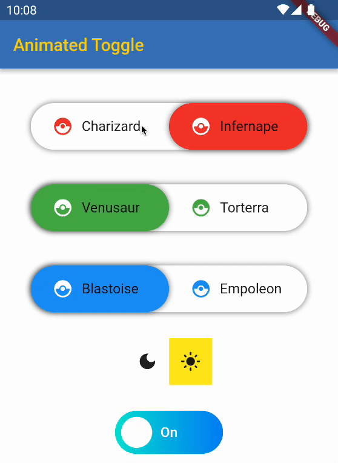

   

# Animated toggle widget

## Features

## Setup

To use this package, add `flutter_animated_toggle` as a dependency in your pubspec.yaml file.

## How to use

See the [Example Code](example/lib/main.dart) for an example on how to use this package.

## Issues

Please file any issues, bugs or feature request as an issue on our [GitHub](https://github.com/Iconica-Development/flutter_animated_toggle) page. Commercial support is available if you need help with integration with your app or services. You can contact us at [support@iconica.nl](mailto:support@iconica.nl).

## Want to contribute

If you would like to contribute to the plugin (e.g. by improving the documentation, solving a bug or adding a cool new feature), please carefully review our [contribution guide](./CONTRIBUTING.md) and send us your [pull request](https://github.com/Iconica-Development/flutter_animated_toggle/pulls).

## Author

This animated_toggle for Flutter is developed by [Iconica](https://iconica.nl). You can contact us at <support@iconica.nl>
